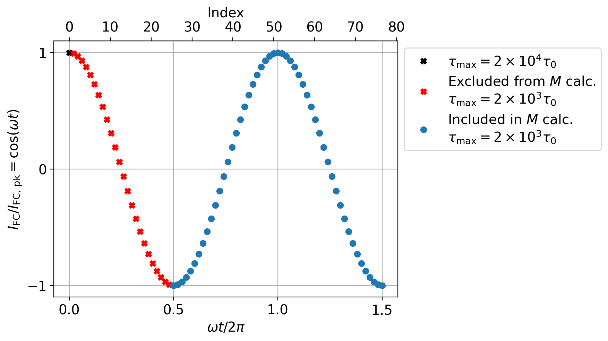

# Vortex dynamics induced by scanning SQUID susceptometry

Note: This directory contains source data which is not stored on GitHub due to large file sizes.
You can download the data from Zenodo.

## Contents
- `code/`
  - `scripts/`
    - `squid_susc_fc_ac.py`: main Python script used for TDGL modeling of SQUID susceptometry.
    - `squid_susc_fc_ac_array.sbatch`: slurm script used to launch TDGL simulations for figure 5.
    - `squid_susc_fc_slot_array.sbatch`: slurm script used to launch TDGL simulations for figure 8.
    - `squid-single-vortex.sh`: bash script used to launch the TDGL simulation for figure 4.
  - `squids/`: [SuperScreen](https://github.com/loganbvh/superscreen) models for SQUID susceptometers.
- `data/`
  - `measurement/`: data from scanning SQUID measurements.
    - `fc-current-sweep/`: scanning SQUID data for figures 3 and 5
    - `slot/`: scanning SQUID data for figure 6.
    - `temperature-sweep/`: scanning SQUID data for figure 2.
  - `simulation/`: data from TDGL simulations
    - `squid-single-vortex/`: simulation results for figure 4
    - `squid-slot/`: simulation results for figure 7.
    - `14122470/`: simulation results for figure 5.
    - `figure5-videos`: animations of the simulated dynamics for figure 5.
    - All other subdirectories: simulation results for figure 8 (see `notebooks/figure-6-and-8.ipynb` and below).
- `notebooks/`: Jupyter notebooks used to generate the figures.

## `figure5-videos`

This directory contains 201 `mp4` files, each of which shows the full time dynamics of the system over 1.5 AC cycles for a different value of the peak field coil current.

The files are named like `merged-{i}.mp4`, where `i=0..200` is an index into the array of peak field coil current values given by `I_fc_pks = numpy.linspace(0.5, 10, 201)`. Each video is a concatenation of 76 TDGL simulations, one for each sample of the applied AC field over 1.5 cycles. The samples are given by

```python
# Values of the peak field coil current
I_fc_pks = numpy.linspace(0.5, 10, 201)
# Number of samples of the AC cycle per peak field coil current
points_per_cycle = 51
cycles = 1.5
npoints = int(points_per_cycle * cycles) # 76
# Dimensionless time
omega_t = numpy.linspace(0, 2 * np.pi * cycles, npoints)
# AC field coil current for I_fc_pks[i]
fc_current_i = I_fc_pks[i] * numpy.cos(omega_t)
# Number of samples at the begninning of the AC cycle
# that are discarded prior to calculating M
skip = int(0.5 * points_per_cycle)
```

For each value of the peak field coil current, the first sample of the AC cycle `omega_t == 0` is simulated with the initial condition that the order parameter is 1 everywhere and no current is flowing. The system is allowed to evolve for a total time `\tau = 2e4 \times \tau_0`. For all subsequent samples, the initial state of the system is taken to be the final state of the previous sample and the evolution time is shortened to `\tau = 2e3 \times \tau_0`. The setup is detailed in the figure below. "Index" refers to an index into the array `fc_current_i`, which is labeled in the upper left corner of each video.



Note that the TDGL model is solved using a variable time step, so the animations do not have a constant frame rate. The x and y axes are shown in units of the coherence length `\xi = 0.9 microns` and the color scales are in dimensionless units.

## Data for Figure 8(b)

The mapping of directory names to datasets for Figure 8(b) is given below. The float keys are peak field coil current in mA and the strings refer to subdirectories of `/data/simulation/`.

```python
fc_current_to_directory = {
    "top_of_slot": {  # Figure 8(b), left column
        1.0: "11376733",
        1.1: "11204356",
        1.25: "11390305",
        1.5: "11280881",
        1.75: "11390289",
    },
    "middle_of_slot": {  # Figure 8(b), right column
        1.0: "11376781",
        1.1: "11233444",
        1.25: "11390407",
        1.5: "11280832",
        1.75: "11390273",
    },
}
```